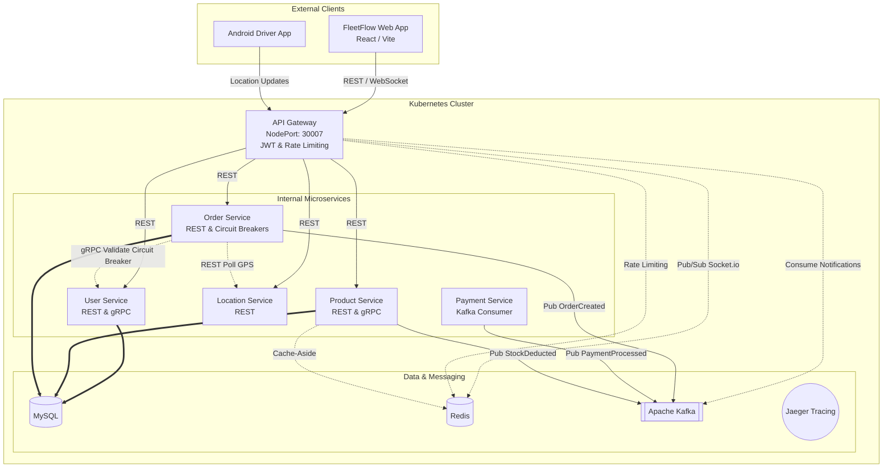

# FleetFlow — Enterprise-Grade Delivery & E-Commerce Microservices

A highly scalable, event-driven distributed system demonstrating the complete lifecycle of an e-commerce order—from secure purchasing and distributed Saga transactions to real-time driver tracking and automated geofenced delivery completion.

This repository serves as a comprehensive showcase of modern backend architecture, utilizing **Node.js, Kafka, Redis, gRPC, WebSockets, MySQL, Docker, and Kubernetes**.

---

## System Architecture & Theoretical Foundations



### 1. Saga Pattern & Event-Driven Architecture (Kafka)
To handle distributed transactions reliably without locking databases, we use the **Choreography-based Saga Pattern** powered by Apache Kafka.
*   **The Flow**: `OrderCreated` → `PaymentProcessed` → `StockDeducted` → `OrderDelivered`
*   **Compensating Transactions**: If stock deduction fails after payment is confirmed, the system emits a `RefundPayment` compensating event to roll back the transaction and maintain eventual consistency.

### 2. High-Performance Caching & Rate Limiting (Redis)
*   **Cache-Aside Pattern**: The `Product Service` caches product lists and details in Redis. Cache is automatically invalidated when stock changes via Kafka events.
*   **Rate Limiting**: The `API Gateway` uses a sliding window rate limiter backed by Redis to protect the cluster from DDoS attacks, ensuring fair usage across all clients.

### 3. Resilience & Fault Tolerance (Circuit Breakers)
*   **Opossum Circuit Breakers**: gRPC calls from the `Order Service` to the `User Service` are wrapped in circuit breakers. If the `User Service` becomes unresponsive, the circuit opens, failing fast to prevent cascading failures and thread pool exhaustion.

### 4. Real-Time WebSockets (Socket.io + Redis Adapter)
*   **Live Notifications**: When an order is delivered (via geofencing), the `API Gateway` consumes the `OrderDelivered` Kafka event and pushes it to the frontend via WebSockets.
*   **Horizontal Scaling**: Using the `@socket.io/redis-adapter`, WebSockets can scale across multiple `API Gateway` replicas. The Redis Pub/Sub mechanism ensures the event reaches the correct user, regardless of which gateway pod they are connected to.

### 5. Distributed Tracing & Observability (Jaeger)
*   OpenTelemetry is integrated to trace requests as they jump across boundaries—from the API Gateway, to REST calls, to gRPC methods, to Kafka events, all visualized in **Jaeger**.

### 6. Zero-Trust Kubernetes Orchestration
The entire cluster is orchestrated using Kubernetes.
*   **Security Boundary**: Only the API Gateway is exposed externally (via `NodePort`). All other services and databases are isolated using internal `ClusterIP`.
*   **Self-Healing**: If Kafka or MySQL restarts, dependent microservices automatically retry connections instead of permanently failing, relying on K8s CrashLoopBackOff and liveness probes.

---

## Core Business Logic & Algorithms

### Real-Time Geofencing (The Haversine Formula)
The system automatically transitions an order from `IN_TRANSIT` to `DELIVERED` without manual driver input.
*   **How it works**: The `Order Service` polls the `Location Service` for the driver's current coordinates. It then compares this against the order's target `deliveryLocation`.
*   **The Math**: We implemented the **Haversine Formula** to calculate the great-circle distance between two points on a sphere given their coordinates. This creates a precise 200-meter geofence natively in the backend without expensive external APIs.

### Stateless Role-Based Access Control (RBAC)
Authentication is handled centrally at the API Gateway using JSON Web Tokens (JWT).
*   **Roles**: The gateway enforces `ADMIN` vs `USER` roles before proxying requests to internal microservices.

---

## Technology Stack

*   **Frontend**: React (Vite) + TailwindCSS
*   **Backend Framework**: Node.js with Express.js
*   **Messaging & Event Streaming**: Apache Kafka (KRaft mode)
*   **Caching & Pub/Sub**: Redis
*   **RPC Framework**: gRPC & Protocol Buffers (`proto3`)
*   **Database**: MySQL 8.0 (Persistent Volumes)
*   **Observability**: Jaeger Distributed Tracing
*   **Containerization & Orchestration**: Docker + Kubernetes
*   **Mobile Client**: Android SDK (Kotlin)

---

## Setup & Deployment Guide

### Prerequisites
1.  **Docker Desktop** installed with **Kubernetes enabled**.
2.  Node.js installed (for local frontend development).

### 1. Build Docker Images Locally
Because we use `imagePullPolicy: Never` in Kubernetes to keep things local, you must build the images first:
```bash
docker build -t api-gateway:latest ./api-gateway
docker build -t user-service:latest ./user-service
docker build -t product-service:latest ./product-service
docker build -t order-service:latest ./order-service
docker build -t location-service:latest ./location-service
docker build -t payment-service:latest ./payment-service
docker build -t frontend:latest ./frontend
```

### 2. Deploy to Kubernetes
Apply the configuration files to start the cluster:
```bash
kubectl apply -f k8s/
```

*Wait until all pods are running (`kubectl get pods`). Note: Some services may enter CrashLoopBackOff temporarily while waiting for Kafka and MySQL to initialize.*

### 3. Access the Application
*   **FleetFlow Web App**: `http://localhost:30080`
*   **API Gateway**: `http://localhost:30007`
*   **Jaeger Tracing UI**: First run `kubectl port-forward svc/jaeger 16686:16686`, then visit `http://localhost:16686`

---

## ☸️ Operations Cheatsheet

### Kubernetes Commands

**1. Apply Changes**
```bash
kubectl apply -f k8s/
```

**2. Teardown All Services**
```bash
kubectl delete -f k8s/
```

**3. View Logs for a Service**
```bash
kubectl logs -f deployment/api-gateway
kubectl logs -f deployment/order-service
```

**4. Check Cluster Status**
```bash
kubectl get pods
kubectl get services
```

**5. Rolling Restart a Service**
If you make code changes and rebuild an image locally, use this to force Kubernetes to pull the new container.
```bash
kubectl rollout restart deployment api-gateway
```
